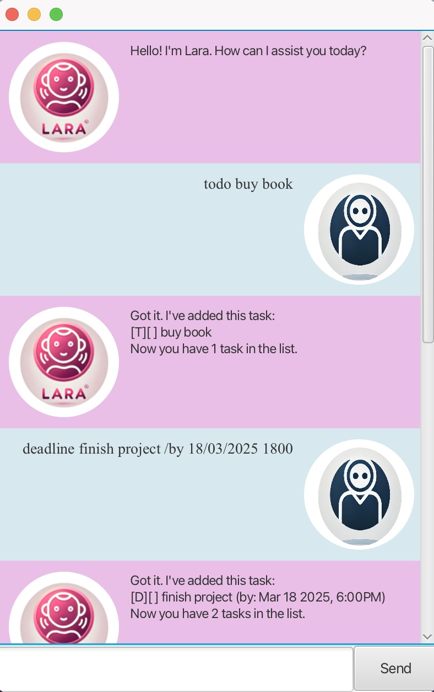

# Lara User Guide



What is Lara?
Lara is your best friend; it’s the task manager chatbot that keeps track of your tasks. It is also:

- Easy to use
  Efficient
  -Fast

### **Installation**
1. **Clone the Repository:**
   ```sh
   git clone https://github.com/malihahaque/Lara.git

## Features
### Adding tasks
Commands:
1. Add ToDos: `todo description`
2. Add Deadlines: `deadline description /by DD/MM/YYYY HHMM`
3. Add Events: `event description /from DD/MM/YYYY HHMM /to DD/MM/YYYY HHMM `

### Listing
The `list` command expects a list of the tasks currently stored.

For example,
```
1. [T][] one
2. [T][] two
```

### Marking & Unmarking
1. `mark [task number]`
2. `unmark [task number]`

### Delete
`delete [task number]`

### Find
`find [keyword]`

### Sort
1. `sort_deadlines` sorts by dates of Deadline type in chronological order.
2. `sort_events` sorts the date of Event type in chronological order of the from date.

## Help
`help
Lists out all the commands used in the chatbot and the exact format.

## ChangeFile
`changeFile <file_path>
Changes the storage file location.

### Close
The `bye` command saves all your tasks and exits the chatbot. You can also manually close the chatbot by clicking the cross in the top left corner. The next time you reopen the chatbot, your tasks will be waiting for you.


