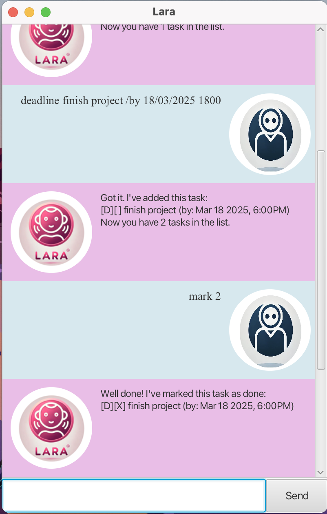

# Lara User Guide



What is Lara?
Lara is your best friend; it’s the task manager chatbot that keeps track of your tasks. It is also:

- Easy to use
- Super fast
- Efficient
  

### **Installation**
1. **Clone the Repository:**
   ```sh
   git clone https://github.com/malihahaque/ip

## Features
### Adding tasks
Commands:
1. Add ToDos: `todo description`
2. Add Deadlines: `deadline description /by DD/MM/YYYY HHMM`
3. Add Events: `event description /from DD/MM/YYYY HHMM /to DD/MM/YYYY HHMM `

### Listing
The `list` command displays a list of the tasks currently stored.

For example,
```
1. [T][] buy book
2. [T][] journal before bed
```

### Marking & Unmarking
1. `mark [task number]`
You can mark a task as done.
2. `unmark [task number]`
Mistakenly marked a task as done? Not to fret, you can also mark a task as not done yet.

### Delete
`delete [task number]`
Deletes the task stored at that number.

### Find
`find [keyword]`
Find your tasks with a specific keyword!

### Sort
`sort` 
Sorts by start dates of deadlines and events in chronological order. After this, you can use the list command to see the list of sorted tasks!

## Help
`help`
Lists out all the commands used in the chatbot and the exact format.

### Close
The `bye` command saves all your tasks and exits the chatbot. You can also manually close the chatbot by clicking the cross in the top left corner. The next time you reopen the chatbot, your tasks will be waiting for you.


